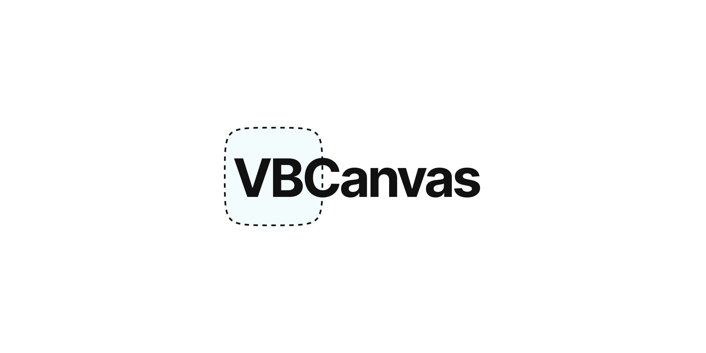

# ⚠️ In development!



# HTML5 Canvas, responsive.

**Getting `<canvas>` to look great is difficult. Making `<canvas>` responsive is even more difficult. VBCanvas is here to make it easy.**

VBCanvas allows you to define a canvas viewBox attribute [just like SVG](https://developer.mozilla.org/en-US/docs/Web/SVG/Attribute/viewBox). Once set, the canvas will automatically position all drawing relative to the viewBox and scale the canvas automatically. Blissful.

## Demo

ADD DEMO HERE

## Installation

### 1. Package Manager

```bash
# npm
npm i vb-canvas

# Yarn
yarn add vb-canvas
```

### 2. CDN

```html
<script src="https://unpkg.com/vb-canvas/dist/vb-canvas.min.js"></script>
```

## Usage

The quickest way to take VBCanvas for a spin is to whip up a simple `.html` file and grab the library from `unpkg`. Once you are all set up, you can create canvasses using `VBCanvas.createCanvas`.

Check out the code below for a complete example.

```html
<!DOCTYPE html>
<html lang="en">
  <head>
    <meta charset="UTF-8" />
    <meta name="viewport" content="width=device-width, initial-scale=1.0" />
    <title>VBCanvas Demo</title>

    <style>
      .canvas-wrapper {
        width: 400px;
        height: 400px;
        margin: 0 auto;
      }

      .canvas-wrapper .vb-canvas {
        width: 100%;
        height: 100%;
      }
    </style>
  </head>
  <body>
    <div class="canvas-wrapper"></div>

    <script src="https://unpkg.com/vb-canvas/dist/vb-canvas.min.js"></script>
    <script>
      /* 
        Define the viewBox width and height, any drawing is done relative to these dimensions
        and will be automatically scaled to whatever size the <canvas> is rendered.
      */
      const canvasWidth = 100;
      const canvasHeight = 100;

      const { ctx } = VBCanvas.createCanvas({
        // viewBox (x, y, width, height)
        viewBox: [0, 0, canvasWidth, canvasHeight],
        // where to mount the <canvas> element
        target: '.canvas-wrapper',
      });

      // simple animation loop (not VBCanvas specific)
      (function draw() {
        // draw a rectangle in the center of the canvas
        ctx.fillRect(40, 40, 20, 20);

        requestAnimationFrame(draw);
      })();
    </script>
  </body>
</html>
```

**For more examples, check out the demo.**

### Module bundlers

To use VBCanvas in a module based environment, just import the `createCanvas` function from `VBCanvas` like so:

```javascript
import { createCanvas } from 'VBCanvas';

const canvasWidth = 100;
const canvasHeight = 100;

const { ctx } = createCanvas({
  viewBox: [0, 0, canvasWidth, canvasHeight],
  ...
})
```
